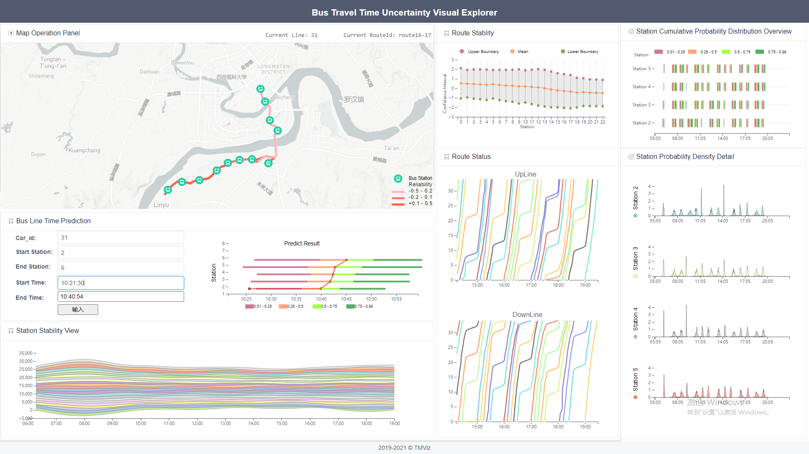

# The Uncertainty Visualization of Bus Running Time Prediction

- The uncertainty is constructed from `aleatoric uncertainty` and `epistemic uncertainty`. 
  - `Aleatoric uncertainty` can be summarized as a class of errors that can not be avoided. For example, the deviation of bus GPS recording equipment.
  - `Epistemic uncertainty` is the uncertainty that exists in our model. The confidence level of bus running time prediction results is discussed to describe the cognitive uncertainty of the prediction model.
- We develop the visualization systems to describe the uncertainty of bus running time prediction, i.e., epistemic uncertainty. In addition, neural network model Bayesian Long Short-Term Memory and Fully connected Layers to predict the bus running time.
## Visualization Interface

## Visual Component
- Map Operation Panel
- Route Stability
- Bus Line Time Predictions
- Route status
- Station Stability View
- Station Cumulative Probability Distribution Overview
- Station Probability Density Detail
## Tools
- Framework - VUE.js
- Visual Components - D3.js
## How to run visualization system?
- Server: npm start
- Client: npm run dev

